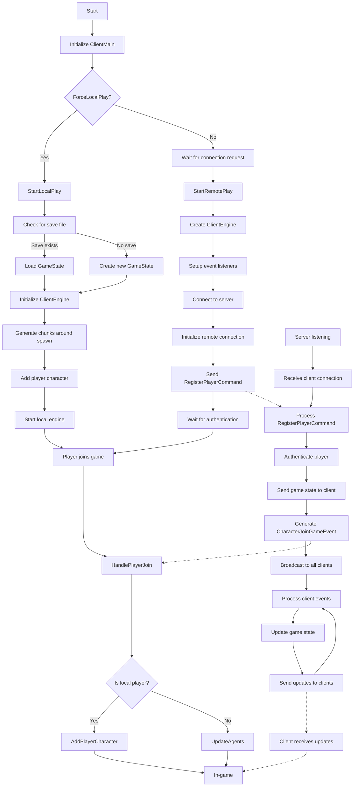

# Dream Builder

General documentation of the Dream Builder project.

Information about the project:

- A game using unity engine, using voxels as world data and rendering
- The player can move around, jump, place block
- The project uses MessagePack for C# for serialization / deserialization.
- The project uses UniTask for Task management and async operations.
- The game supports networked multiplayer using the networking strategy described
  at https://gafferongames.com/post/state_synchronization/ / [Backup](Images/State%20Synchronization%20_%20Gaffer%20On%20Games.html)
- Language version is C# 9 for the whole project.

## Prerequisites

- Install .Net core 9.0 (https://dotnet.microsoft.com/en-us/download/dotnet/9.0)
- Install Unity (check the required version of the project in your Unity Hub, after loading TopDownVoxelsEngineUnity, should be unity 6+)
- Install Git (must be available as CLI)

## Architecture

The project is split as:

- The client (A Unity project, .net 2.1 Mono) in `./TopDownVoxelsEngineUnity`
- The server (a .net core project) in `./Server`
- Shared code (a library project, compiled as .net core by the server and .net 2.1 Mono by the client) in `./TopDownVoxelsEngineUnity/Assets/Shared`
- Test projects (for unit tests of the shared and server code) in `./Server/Tests`
- Documentation in `./Documentation`

### Server

- Open ./VoxelsEngineFullSolution.sln in the project root. The solution contains those projects:
    - Server: .net6.0 C# 9 .NET core web application. A server that handles gameEvent validation, networking
      and DB saving.
    - Shared: netstandard2.1 C# 9 library. Contains most of game logic and data models. It does not use the same .net
      platform to ensure cross compatibility with Unity.
    - Tests: .net6.0 C# 9 unit test project. Testing game logic and data (Shared).
- Use your IDE "Run" tooling (we use Jetbrains Rider) to start the server

### Client

- Open the TopDownVoxelsEngineUnity project in Unity + IDE (we use Rider)
- Use play mode to run the client
- Most game files are into `TopDownVoxelsEngineUnity/Assets/VoxelsEngine`

### Shared

- Shared project in located under `TopDownVoxelsEngineUnity/Assets/Shared`.
- Compilation is handled by Unity client-side, and by netstandard2.1 platform server-side. It must remains compatible in both contexts.
- Sirenix annotations have been added in the server project so that they can also be used in shared.

### Documentation

All documentation under `./Documentation` and as code comment.
[TODO.md](TODO.md)
Documentation index:

- [BLUEPRINTS.md](BLUEPRINTS.md)
- [BLUEPRINTS_IMPLEMENTATION.md](BLUEPRINTS_IMPLEMENTATION.md)
- [GAME_DESIGN.md](GAME_DESIGN.md)
- [PROJECT_DESIGN.md](PROJECT_DESIGN.md)

## Networking

Data is exchanged between client and server using INetworkMessages. All messages objects should be in `<Shared>/Net/Messages`.
Messages are serialized using MessagePack.
Messages can be of 3 types: 
- GameEvent:
  - Can be initiated by the client or the server.
  - Must be validated by server.
  - Can be optimistically applied by the client. In case of error: rollback and reapply in order.
- Command:
  - From client to server, ask for an operation.
  - Server answers with an AckResponse message.
- Query:
  - From client to server, ask for data (no side effect).
  - Server answers with the appropriate response.
- Response:
  - Answers to a query

## Coding guidelines

- Match existing code style.
- Code should be as simple as possible, performant, robust, and readable.
- Prefer clear naming, XML documentation on public APIs, and immutable data where reasonable.
- Prefer public fields unless accessors are required. Ie. prefer `public string Name;` over `public string Name { get; set; }`
- Keep Unity scripts in appropriate folders (e.g., Assets/VoxelsEngine/*).

### Nullable

C# 8: Nullable Reference Types is a compiler option to raise warning when some nullability case are not explicitly
handled. It is enabled in most or our code.
See [https://www.meziantou.net/csharp-8-nullable-reference-types.htm](https://www.meziantou.net/csharp-8-nullable-reference-types.htm)

- The nullable compiler option is enabled on :
    - (Server) Shared project thanks to the `<Nullable>enable</Nullable>` entry in Shared.csproj
    - (Server) Server project thanks to the `<Nullable>enable</Nullable>` entry in Server.csproj
    - (Server) Test project thanks to the `<Nullable>enable</Nullable>` entry in Test.csproj
    - (Unity) Shared module thanks to the `csc.rsp` file aside `Assets/Shared/Shared.asmdef`
    - (Unity) VoxelsEngineClient module thanks to the `csc.rsp` file aside `Assets/Scripts/VoxelsEngineClient.asmdef`
    - (Unity) VoxelsEngineEditor module thanks to the `csc.rsp` file aside `Assets/Editor/VoxelsEngineEditor.asmdef`

### Code safety

- Both client and servers are configured with null safety enabled by default
    - On the client, this is done by settings csc.rsp in the TopDownVoxelsEngineUnity/Assets/Shared and
      TopDownVoxelsEngineUnity/Assets/Scripts/VoxelsEngine folder:
      ``` 
      -nullable
      ```
    - On the server, this is done by configuring the csproj file:
      ```xml
      <PropertyGroup>
          …
          <Nullable>enable</Nullable>
      </PropertyGroup>
      ```
    - On the server, it's possible to finetune specific folders using "Directory.Build.props" in folders :
      ```xml
      <Project>
        <PropertyGroup>
          <Nullable>disabled</Nullable>
        </PropertyGroup>
      </Project>
      ```
    - For third party code that would get caught in the nullable enabled directive while no written this way, #nullable
      disabled is add as first line in all files.
    - Most third-party code is ignored in Inspection settings > Exclude.
- The client uses Odin validator to enforce safety in the Scenes and gameobject.
- To allow shared and serve project to support odin attributes, following configuration was added in the project
    ```xml
    <Reference Include="Sirenix.OdinInspector.Attributes, Version=1.0.0.0, Culture=neutral, PublicKeyToken=null">
        <HintPath>..\Plugins\Sirenix\Assemblies\Sirenix.OdinInspector.Attributes.dll</HintPath>
    </Reference>
    ```

## Junie Automation Notes
- Operating system: Windows. Use backslashes in paths (e.g., D:\lonestone\GameStudioLab\TopDownVoxelsEngine).
- Prefer specialized tools in this environment (e.g., test runners and project search) instead of generic shell operations.
- When running tests via automation, prefer solution-wide test execution.

### Blueprint System

The Blueprint system allows players to save and load collections of blocks, facilitating building and construction in the game world.

**Key Features:**

- Server-side storage for sharing across all players
- Support for transformations (rotation, flipping)
- Blueprint metadata for efficient browsing
- Integration with existing block placement systems

See [BLUEPRINTS.md](BLUEPRINTS.md) for user-facing documentation and [BLUEPRINTS_IMPLEMENTATION.md](BLUEPRINTS_IMPLEMENTATION.md) for technical implementation details. The client-side implementation plan is detailed in the "Client Implementation Plan" section of BLUEPRINTS_IMPLEMENTATION.md.

## Publication

- For server :
    - TODO
- For client :
    - Standard unity build for WebGPU
    - Deployment using [deploy_web_build.bat](./deploy_web_build.bat)

## Server development

### Manipulating database: Installing DB EntityFramework (EF) tools

You need to install EF Design tools to manipulate the database.

```
dotnet tool install --global dotnet-ef
dotnet add package Microsoft.EntityFrameworkCore.Design
```

To create
a [migration script](https://docs.microsoft.com/en-us/ef/core/managing-schemas/migrations/?tabs=dotnet-core-cli)

```
dotnet ef migrations add <MigrationScriptName>
```

To update the database by running new (not already ran via table \_EFMigrationsHistory in DB), migration scripts :

```
dotnet ef database update
```

### Réinitialiser la base de dev

Pour réinitialiser la base de données locale et régénérer le modèle à l'aide de Entity Framework Core, vous pouvez
utiliser les commandes suivantes dans la console du gestionnaire de paquets (Package Manager Console) ou dans l'invite
de commande (Command Prompt) :

Supprimer la base de données :

```shell
dotnet ef database drop
```

Créer une nouvelle migration :

```shell
dotnet ef migrations add InitialCreate
```

Appliquer la migration pour créer la base de données :

```shell
dotnet ef database update
```

Notez que vous devez être dans le répertoire du projet qui contient le fichier .csproj pour exécuter ces commandes.
De plus, le nom InitialCreate est juste un exemple, vous pouvez le remplacer par le nom que vous voulez donner à votre
migration.

Si vous utilisez la console du gestionnaire de paquets dans Visual Studio, vous pouvez utiliser les commandes suivantes
à la place :

Supprimer la base de données :

```shell
Drop-Database
```

Créer une nouvelle migration :

```shell
Add-Migration InitialCreate
```

Appliquer la migration pour créer la base de données :

```shell
Update-Database
```

Encore une fois, InitialCreate est juste un example et peut être remplacé par le nom que vous voulez donner à votre
migration.

### Csproj

The server .csproj files contains several specific and important import, do NOT MODIFY THIS FILE.

### Cautionary notes

BaseIntermediateOutputPath and BaseOutputPath via `Directory.Build.props` can be tricky with our setup.

The "Server" project declares a default `OutputPath` in its .csproj to ensure EF tools can run correctly.

The "Shared" project (server-side) also has a `Directory.Build.props` file to copy the `bin/` and `obj/` folders
in `$(SolutionDir)SharedBin` so that Unity excludes the server-generated DLL during the client compilation.

See https://github.com/dotnet/efcore/issues/23853

---

## Client behaviour


