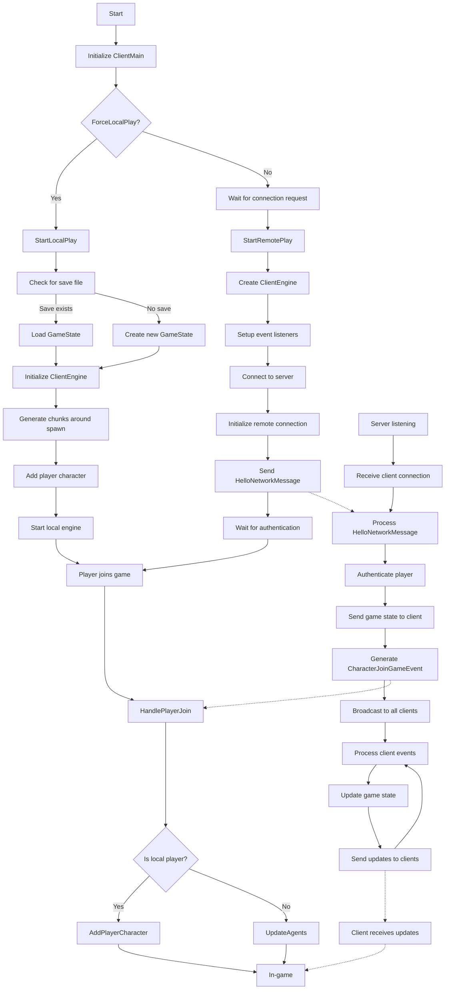

# Dream Builder

General documentation of the Dream Builder project.

---

## Prerequisites

- Install .Net core 6.0 (https://dotnet.microsoft.com/en-us/download/dotnet/6.0)
- Install Unity (check the required version of the project in your Unity Hub, after loading VoxelsEngineUnity)
- Use `dotnet tool restore` in the `VoxelsEngineUnity` folder to enable code generation support for
  MessagePack. [See MessagePack code generation documentation for more information](https://github.com/neuecc/MessagePack-CSharp#aot-code-generation-support-for-unityxamarin)

---

## Architecture

- Server project (./Server): Server (.NET core) code
- VoxelsEngineUnity project (./VoxelsEngineUnity): Client side code
- Shared project (./VoxelsEngineUnity/Assets/Shared): Shared code

---

## Overview

### Open the projects

- You need to (autonomous)
- And the Server + Shared project (not only the server), using ./VoxelsEngine.sln in the project root

### Server

- Open ./VoxelsEngine.sln in the project root. The solution contains those projects:
    - Server: .net6.0 C# 9 .NET core web application. A server that handles gameEvent validation, networking
      and DB saving.
    - Shared: netstandard2.1 C# 9 library. Contains most of game logic and data models. It does not use the same .net
      platform to ensure cross compatibility with Unity.
    - Tests: .net6.0 C# 9 unit test project. Testing game logic and data (Shared).
- Use your IDE "Run" tooling (we use Jetbrains Rider) to start the server

### Client

- Open the VoxelsEngineUnity project in Unity + IDE (we use Rider)
- Shared project in located under `VoxelsEngineUnity/Assets/Shared`. Compilation is handled by Unity client-side, and
  by netstandard2.1 platform server-side. It must remains compatible in both contexts. Sirenix annotations have been
  added in the server project so that client can use them.
- Use play mode to run the client
- Most game files are into `VoxelsEngineUnity/Assets/VoxelsEngine`

### Nullable

C# 8: Nullable Reference Types is a compiler option to raise warning when some nullability case are not explicitly
handled. It is enabled in most or our code.
See [https://www.meziantou.net/csharp-8-nullable-reference-types.htm](https://www.meziantou.net/csharp-8-nullable-reference-types.htm)

- The nullable compiler option is enabled on :
    - (Server) Shared project thanks to the `<Nullable>enable</Nullable>` entry in Shared.csproj
    - (Server) Server project thanks to the `<Nullable>enable</Nullable>` entry in Server.csproj
    - (Server) Test project thanks to the `<Nullable>enable</Nullable>` entry in Test.csproj
    - (Unity) Shared module thanks to the `csc.rsp` file aside `Assets/Shared/Shared.asmdef`
    - (Unity) VoxelsEngineClient module thanks to the `csc.rsp` file aside `Assets/Scripts/VoxelsEngineClient.asmdef`
    - (Unity) VoxelsEngineEditor module thanks to the `csc.rsp` file aside `Assets/Editor/VoxelsEngineEditor.asmdef`

---

## Publication

- For server :
    - TODO
- For client :
    - Standard unity build for Android and IOS

## Server development

### Manipulating database: Installing DB EntityFramework (EF) tools

You need to install EF Design tools to manipulate the database.

```
dotnet tool install --global dotnet-ef
dotnet add package Microsoft.EntityFrameworkCore.Design
```

To create
a [migration script](https://docs.microsoft.com/en-us/ef/core/managing-schemas/migrations/?tabs=dotnet-core-cli)

```
dotnet ef migrations add <MigrationScriptName>
```

To update the database by running new (not already ran via table \_EFMigrationsHistory in DB), migration scripts :

```
dotnet ef database update
```

### Réinitialiser la base de dev

Pour réinitialiser la base de données locale et régénérer le modèle à l'aide de Entity Framework Core, vous pouvez
utiliser les commandes suivantes dans la console du gestionnaire de paquets (Package Manager Console) ou dans l'invite
de commande (Command Prompt) :

Supprimer la base de données :

```shell
dotnet ef database drop
```

Créer une nouvelle migration :

```shell
dotnet ef migrations add InitialCreate
```

Appliquer la migration pour créer la base de données :

```shell
dotnet ef database update
```

Notez que vous devez être dans le répertoire du projet qui contient le fichier .csproj pour exécuter ces commandes.
De plus, le nom InitialCreate est juste un exemple, vous pouvez le remplacer par le nom que vous voulez donner à votre
migration.

Si vous utilisez la console du gestionnaire de paquets dans Visual Studio, vous pouvez utiliser les commandes suivantes
à la place :

Supprimer la base de données :

```shell
Drop-Database
```

Créer une nouvelle migration :

```shell
Add-Migration InitialCreate
```

Appliquer la migration pour créer la base de données :

```shell
Update-Database
```

Encore une fois, InitialCreate est juste un example et peut être remplacé par le nom que vous voulez donner à votre
migration.

### Csproj

The server .csproj files contains several specific and important import, do NOT MODIFY THIS FILE.

### Cautionary notes

BaseIntermediateOutputPath and BaseOutputPath via `Directory.Build.props` can be tricky with our setup.

The "Server" project declares a default `OutputPath` in its .csproj to ensure EF tools can run correctly.

The "Shared" project (server-side) also has a `Directory.Build.props` file to copy the `bin/` and `obj/` folders
in `$(SolutionDir)SharedBin` so that Unity excludes the server-generated DLL during the client compilation.

See https://github.com/dotnet/efcore/issues/23853

---

## Client behaviour


