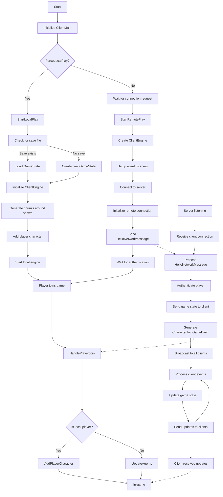

# Dream Builder

General documentation of the Dream Builder project.

Informations about the project:

- A game using unity engine, using voxels as world data and rendering
- The player can move around, jump, place block
- The project uses MessagePack for C# for serialization / deserialization.
- The project uses UniTask for Task management and async operations.
- The game supports networked multiplayer using the networking strategy described
  at https://gafferongames.com/post/state_synchronization/ / [Backup](Images/State%20Synchronization%20_%20Gaffer%20On%20Games.html)
- Language version is C# 9 for the whole project.

## Prerequisites

- Install .Net core 9.0 (https://dotnet.microsoft.com/en-us/download/dotnet/9.0)
- Install Unity (check the required version of the project in your Unity Hub, after loading TopDownVoxelsEngineUnity, should be unity 6+)

## Architecture

The project is split as:

- The client (A Unity project, .net 2.1 Mono) in `./TopDownVoxelsEngineUnity`
- The server (a .net core project) in `./Server`
- Shared code (a library project, compiled as .net core by the server and .net 2.1 Mono by the client) in `./TopDownVoxelsEngineUnity/Assets/Shared`
- Test projects (for unit tests of the shared and server code) in `./Server/Tests`
- Documentation in `./Documentation

### Server

- Open ./VoxelsEngineFullSolution.sln in the project root. The solution contains those projects:
    - Server: .net6.0 C# 9 .NET core web application. A server that handles gameEvent validation, networking
      and DB saving.
    - Shared: netstandard2.1 C# 9 library. Contains most of game logic and data models. It does not use the same .net
      platform to ensure cross compatibility with Unity.
    - Tests: .net6.0 C# 9 unit test project. Testing game logic and data (Shared).
- Use your IDE "Run" tooling (we use Jetbrains Rider) to start the server

### Client

- Open the TopDownVoxelsEngineUnity project in Unity + IDE (we use Rider)
- Use play mode to run the client
- Most game files are into `TopDownVoxelsEngineUnity/Assets/VoxelsEngine`

### Shared

- Shared project in located under `TopDownVoxelsEngineUnity/Assets/Shared`.
- Compilation is handled by Unity client-side, and by netstandard2.1 platform server-side. It must remains compatible in both contexts.
- Sirenix annotations have been added in the server project so that they can also be used in shared.

### Documentation

All documentation under `./Documentation` and as code comment.
[TODO.md](TODO.md)
Documentation index:

- [BLUEPRINTS.md](BLUEPRINTS.md)
- [BLUEPRINTS_IMPLEMENTATION.md](BLUEPRINTS_IMPLEMENTATION.md)
- [GAME_DESIGN.md](GAME_DESIGN.md)
- [PROJECT_DESIGN.md](PROJECT_DESIGN.md)

## Coding guidelines

- Match existing code style.
- Code should be as simple as possible, performant, robust, and readable.
- Prefer public fields unless accessors are required. Ie. prefer `public string Name;` over `public string Name { get; set; }`

### Nullable

C# 8: Nullable Reference Types is a compiler option to raise warning when some nullability case are not explicitly
handled. It is enabled in most or our code.
See [https://www.meziantou.net/csharp-8-nullable-reference-types.htm](https://www.meziantou.net/csharp-8-nullable-reference-types.htm)

- The nullable compiler option is enabled on :
    - (Server) Shared project thanks to the `<Nullable>enable</Nullable>` entry in Shared.csproj
    - (Server) Server project thanks to the `<Nullable>enable</Nullable>` entry in Server.csproj
    - (Server) Test project thanks to the `<Nullable>enable</Nullable>` entry in Test.csproj
    - (Unity) Shared module thanks to the `csc.rsp` file aside `Assets/Shared/Shared.asmdef`
    - (Unity) VoxelsEngineClient module thanks to the `csc.rsp` file aside `Assets/Scripts/VoxelsEngineClient.asmdef`
    - (Unity) VoxelsEngineEditor module thanks to the `csc.rsp` file aside `Assets/Editor/VoxelsEngineEditor.asmdef`

## Project Design

### Multiplayer, State changes and networking

The networking strategy implies that both server and client can run the simulation in a similar way. This is what the
Shared project library is for.
The Shared project defines :

- GameState: The data model that can store a whole game.
- Actions (called GameEvent): The events can be applied to the game state to make it change. Only actions are allowed to
  write the state.

GameEvents works as follow :

```csharp
public abstract class GameEvent : IGameEvent, INetworkMessage
{
    public abstract int GetId();

    // public api cannot be overriden, it simply use the GameState API to apply itself
    public void Apply(GameState gameState, SideEffectManager? sideEffectManager) {
        gameState.ApplyEvent(DoApply, sideEffectManager);
    }

    // Method implemented by each event and only portion of the application to modify the GameState
    protected internal abstract void DoApply(GameState gameState, SideEffectManager? sideEffectManager);
    
    // Mostly for developper experience, express the assertions required for the event to succeed.
    // It helps the develop knows the presequites for this GameEvent to be applied;
    public abstract void AssertApplicationConditions(in GameState gameState);
}
```

GameEvents are produced by the client when interacting with the game.
Any input that would change the GameState triggers a GameEvent that is :

- dispatched to server,
- applied immediately on the client (optimistic update).

In case the event is accepted by the server, the GameEvent is broadcast to all players (including the sender) using the
same id.
If the client is the sender (id in the sentbox), it will not re-apply the event.

The server will continuously provide state update of player / npc / elements positions and velocities, with a
prioritization effort to update near data more frequently.

Prioritization is made using a priority accumulator for each state entry (using encaplusated data) EXCEPT for blocks.

Mostly, each client will run it's own simulation at it's own pace (as long as it is not too far away) and the server will send both input updates (game event to apply) and state updated (
values to override).
The client catches up out of sync content on the go.
Game ticks are run at 50 ticks/seconds = 20 ms per tick, are applied as a TickGameEvent, and are implicitly executed by all clients and server.

Every 10 seconds, the server will try a full reconciliation. The idea is to bundle all the "near state" of each player, and send :

- id of the state (TickId)
- List of events to (re) apply on it
  The client can then re apply sent event since this tick that the server did not ack.

#### position synchronisation

https://sequencediagram.org/index.html#initialData=A4QwTgLglgxloDsIAIDCALcIYQKZgEEBzXJAKFElnhCTQBspSIBRBIqBXC8aORFAGV8AN1wBXMGQxYc+YswC0APmUyw2PIRJIAXMgDaAVWAATEHgC6yADJQU9AOSdg4lKfHIAVgHtxEqXVNeR0IFTVMDTltZn1jMwtcawBZXBQAA+8-MGQRe1wAZwLcZDTkWiJ6EtJkADMfBBwoBuRTQuQXNwLpSOCYpHDURmY2Di44k3MrZAAVDQQCgFsyvLwi6pQKqulhpFHOXEHd1nYD-VQQehhxKuR6EGQEPzF6W+AfAvtmhGRMmEwAI7+ZB8ADWOyYe1OXEGvWiCj0s3mSzK90ez1wrxK70+0AaPVkWgRYVUQXhoTiADEoAAPXCmSaJawEWq1WDoEpvfAFBoIEAkcqeABGLVIpjAPnsEJG0MOqmEYDEkn0bBEkpK4h+yyK-JKIDEMGQOK+DQANLl8utzVtcAAdBB-QHAsHIAAUIGAYAAFwVkDBLtd6ABKMgKpVgcJhgLnAM3TkPJ7iF5vD4mn6OkBAkpg0OiAJHSEnMa4fQAIQlIFM-oKDgexrxPzaIL8vqqvuA3I+v2b4lb7Rgx26Q0L+xhpOOo5LyFSGSykiNqYbpRQq0KxVa7Q7YB5vvtggIRkpC-nt18-nnNRg2V9rtMAEuvJlMmewCGgA


There is 3 levels of synchronisation. In the end what matters is that the client displays the object at the right
location :

- The server take the current velocity and applies it to the position. It sends the position and velocity to clients so
  that they improve their predictions and update their state.
- The client read from input, generate an event, send to server and applies to the state during the fixed update to
  anticipate the server latency.
- The client read from input and immediately updates the CharacterAgent. It keeps interpolating from the last
  fixedUpdate GameState value toward the expected position.

#### Chunks generation and synchronisation


https://sequencediagram.org/index.html#initialData=C4S2BsFMAIFEDsBuB7E0AmkDOHn3gJfYbEDGAFgK7wDWOAhpdKeCJPMAFCcAO9ATqFIg+HaAGFW7Ln0Ehho4NADKkfokiV+3TpLYcAtAD5V6zfwBcEvPEilgMehtLQearDfoBzSN3DJkHmgAQWZyegBHShghGk5oBJU1DS1jUxTLaAARAgd+AFsQWzDqOmhGYGQtDCY3fg98b19EpLNUk2TzKwAFfhBkPqwYClKcWVd+ZAAPEELgAnjE9PM0zq0rADEQcGB+YapaHHg8A3YUAE8CLEWE+h2JA5poY-hoLwJCfgWWluX2v8yG3oYGg1BgmHy9HgmBIbw+BH49FAeBqJVoNx+xwc0GQGn4rQyVnEj3KACsqvNoAAD6DgejQABm23BAHIzqhoJCQGN6Dh2ZcMZBwEMHqU4Z9vj8EgDjHppFYECg2Lh8EQcJgcCNDoLoZx2OgMS05YYjMbgFYALKQJQ08nVKDQLDAJGOZy04joGxqkiax7XKUJM2yqQcKwANQRICZMCwaAdWqe2CUiG5IAARlBDYkg6aQ+boAAlOx3UiUB0OvbQpgACljaKeKdjGcgAEogA

#### block placement

- The server take the changelist of blocks from all players input and the missing data of clients
- The client read from input, generate an event, send to server and applied to the state during fixed update to
  anticipate the server latency.
- There is some optimistic update, an animated VFX is played immediatly to cover the latency

##### conflict scenario


https://sequencediagram.org/index.html#initialData=C4S2BsFMAIGEHsB2AzcZrngJwM7QCYzgCG0ADvDjPgOQCui0ARpgMYBQ7ZxWorI3RMGgApeHUh0sAIS48+A4kOgBlSFgBukrHN4h+g4WIlSAgp0TxgMeFqyr1WqQC5oAGRgArcduikNpBRU9gzMbNCQjAC2AFdRMNZRZHgAjhIYXj5S0NIAOohRxCB4UNDBTvalWJCskBpYpMRkWAAXOAB0+R54rGiRwHiFIEIgkYj9BJAlxdZ4hNABaPjEoEjk4vYUdBrwIFj5WPDg4EzErADWEYwr1ojLyiQLxEsrIGv4dGWO2u2cxtrSAC0AD41JptK4AAqUIgwFjwVg5ABM7H+UiBwLRMlcAFFENUAOYzarIq5+YC3ayTJ4vVaIVFZLCmEFgipQmEZMII6CmACsDJMTJBWNMuPxkCJOGAJL5ZJu-WoMEWIGWdPYrO0gOFjOkrgA8gBpAAU0iRAEoBQDtYLdao6GRmiB4qT5o80FKYJFyZTIOrvlJrdpRTlDsR8KxiFLkZazIGzK4ANqhACX4GT8WUzWTrGThGUU2EXvlQkgAF18njCcSYKa5RSFdTlaq3vSRXGma4ACoN2hNMhoNLqUlG9TVKQWtug-1YdlUTnwxGmABsMaFmMZwcrEurPKXdZ9jeeKteSHYliptiHGqkABpRBvXLLxuRJMJuHgYtKYH2B3Rk9AAAPoAjOg53mU1OkQDxgL6ZQQAJSwSSgPBR20FDhGLfAShobB8GqfIPi+cEpD9YisC1ddBWDAA5Q0jT5CcN3bYMACUjhOM5LmXO9TTvPlV2ZSig1cFR7UdZ1ZVdUh3SpIt6xLATmNcFjkx-EBB2RPiV0nEUuyUYQNNKZpICiUZ7FTdMJnmHBpJmT0o1oUJiDoL9oG8QUb3yEBwDKMSsCdIgaAsjNgHaO0HX850IM4a9yKU6A6OXC1YvbW0mFDcNI2EZdFKE+NwvEmBl2pN07P3BVct06BO306BDJgYzTKHYKrJgGyMDKgsCHoa4XJJdztE8xBvN8iKAowIK0xCsKjRkpUVUgC0gA

- les modifications (ie. pose de blocs) dont identifées par un id uniquement généré par le client. ie. B2 pour le bloc posé par B et A5 pour celui posé par A.
- A pose un Bloc et enregistre localement sa modification dans une liste ordonnée "en attente de validation"
- B pose un bloc au même endroit en même temps et enregistre localement sa modification dans une liste ordonnée "en attente de validation"
- le serveur reçoit B puis A et applique dans cet ordre. Le serveur de maintient pas de liste de validation car il applique dans l'ordre d'arrivée.
    - Le serveur envoi ok à B et broadcastà A la modification
    - Le serveur envoi nok à A
- B reçoit ok(B2)
    - il supprime B2 de sa liste
    - tant que le premier élément de sa liste est une modification d'un autre joueur, il supprime l'élément (lite vide)
- entre temps, A pose un bloc (A6) et enregistre localement cette modification dans sa liste "en attente de validation"
- A reçoit B2
    - il tente d'appliquer B2 lors de la réception du broacast mais erreur (ou pas). Il garde B2 dans sa liste "en attente de validation".
- A reçoit nok(A5)
    - il rollback dans l'ordre inverse toute sa liste d'en attente jusqu'à A5 inclus: A6, B2 (sans effet) puis A5
    - il supprime A5 de sa liste (restent B2 et A6)
    - il réapplique dans l'ordre toutes les modifications de sa liste "en attente de validation" (B2 puis A6)
    - tant que le premier élément de sa liste est une modification d'un autre joueur, il supprime l'élément (reste A6)
- A reçoit ok(A6)
    - il supprime A6 de sa liste
    - tant que le premier élément de sa liste est une modification d'un autre joueur, il supprime l'élément (lite vide)

#### Client

ClientMain.cs is a MonoBehaviour in charge of orchestrating the game at high level (starting a local game, a remote
game, leaving the server, etc.)
ClientEngine.cs is a MonoBehaviour in charge of running a local game (ticks at fixedupdate, keep track of the state,
applying GameEvents)
Player the is entity who interacts with the game throw inputs.
CharacterAgent.cs is in charge of both transforming the player input into GameEvents, and is a visual representation of
the player character.

Start a local game
https://sequencediagram.org/index.html#initialData=C4S2BsFMAIBMEuC2BDATq5BzGB7ArtAMYAWa2ikAdsHAOR6UwAOaoM4OhyUAUC6qEIgW1aAGFwIKsACyyEJT6sQQkTQlTqAUUqYFkHj27rSqbNAbNl7TtxiQAHiADOwZNQPQv4ydLkKAWgA+II1pHT1GAC5xU3NLaH42aA4uKGhHFzcPHm8fTWAI-WDQ321dfRixOPYYV2RgOuQ8ADdITDQEAB1KZDbCFOZIVGccSl7zACt8SDxUDJp0xDHYA0hwZxgAESQ0VBgEynw28HSkqVzvMOp-ShLrworo6C3IFEpVuBgEFHRhi0Y0COrXWZ2sly8DyKjHuZUekUgMQAkpQwCBuC4DpQgcdIM1oPVGj0+pABgwcSD8csPvYaOTgW18UxhqNxlgYNM8LNUDwqLBDDwoU9ILCCrdkR8QABHLnQGW1ZxwMaUeCQRUKNF2RWsmhMVAAK8aiXw832Hzwgrht1F4WFMR2v32KWQiWsQA


#### Server

Start server
https://sequencediagram.org/index.html#initialData=C4S2BsFMAIBEEuC2BDATq5BzGATA5AK4B20AzpKgG6QGrQ4wBWNAUCwMoXW0C0AfJyo1UALjhI0qSBy7D+g7qOgBxeEQAXU+pFLQAxgAtiAa13ICwAPa16BaAAdLIIsG1l7yAO5EZQ3gNlaMQBJvWtgXB0HS1RgXU9IACNSSz1jSGBfRXlApVDwyN1HWN0AVVgABSy5PgAhZHI3WEsiIngdMQBhFqJIAA8QFugAA+hwZGhEhsj6HvbSFmRwVwA5a2pwKAc0UGlofegFGqOg6E7UduhiGCJ1yE2YD1iQPYOT1H56xoY4OY7oACiRCkmBApGAUkQkBcbnG22eMD0F2k90aFR2L2g-TBwGQLle+3en2mTT+pC6BjQ2DGEyeuyxA3BeIiLAO0C+M2arXmPByfiU6IRDJxzMRlNQmHaLGhOBYtwi0Es1Do7zE7wcqAAV65Rsg9HpIPYInQGLowq1sS0FkA


Client connexion
https://sequencediagram.org/index.html#initialData=CoSwLgNgpgBAwgewHZKgDxMmATA5AVyRgGMIQokwYADmQmAZygCcA3KfZnWAKw4Ch+cMhTABaAHwBlFu04AuGAEmwAQwBGZKoVjFkqDFgYJiAayhUAFCAAOAGhg2EzMAEp+Mth2aTPc5vIAggzGxOQw0Iwm5lS09AwAFs5gAJLYMADmAJdIWcxZMADEAAoQqgCeLFJJLmkest5iksLklIqIKOiYRKrExFA2YFlQQiKUvg0KMAASUBAQCAByFgDuzqYAslAhqhlQlkiqALZQ7kgIYLDMIBkJVAgAZjB+3kH4YAmiIA8gxKpg3Rw+BIYzA9S8nAmEICMAAanlvuEGCAIrpQTBVHQiDYWMYULtYF0GGpKPxVBAqMVmFAjuQuKRWmCYMznpMfNI2e18rB6Od8OxVMCccw8Yc9o4EJxUSDGfw5kx4OiiSSmSyXpCJAAhVQK7CwAAi+mGDEUACUssR8DYABfU6XC0UEmDK1SUIEy0T8FkwbW6g1G7ZNDnQxTFXH6J0u0kUbD8BYIGwwYqS+kJVQAR3wvEl3hI+igxCG4P8QZaonaaeYvUuzAAUggQEgAOLHKAAUXYlEsiWSaQccEr1ZYDgAMlB2BApDZVCskO4Y161WzS6D5APVFXCyx642WycO6JLCUypVmNVe9h+4Ot8xR+O5lOZ3P+OdLjAEOwuGW2jAxx63awCI-LAyLwNeNYAHSLK2zrEjAWQZOSGLAocJzOkgrAIOUWQvhcsAfiwiqMoof4MqIeZHCcSD9DQMA8DmzBkhSMD6ha+aGEQ2DAmRpLevGiYAGwwACJwMIu3rMt+4jBv4ijAKIsB6owVwFvmN7iRJ6o+M0q7wOxgK9P0gzDBp3qvvhn5EaIdhaSRaKMjA1I2NSSDpJEfD4BpC5mXhjk3Hc75PFJihSCiYCSpcDColFlyUP8IDsFFSnUnonQcfBxBJFmlAOJEPFUBuzAAFdvng2wMBULByq5-BAA


### Code safety

- Both client and servers are configured with null safety enabled by default
    - On the client, this is done by settings csc.rsp in the TopDownVoxelsEngineUnity/Assets/Shared and
      TopDownVoxelsEngineUnity/Assets/Scripts/VoxelsEngine folder:
      ``` 
      -nullable
      ```
    - On the server, this is done by configuring the csproject file:
      ```xml
      <PropertyGroup>
          …
          <Nullable>enable</Nullable>
      </PropertyGroup>
      ```
    - On the server, it's possible to finetune specific folders using "Directory.Build.props" in folders :
      ```xml
      <Project>
        <PropertyGroup>
          <Nullable>disabled</Nullable>
        </PropertyGroup>
      </Project>
      ```
    - For third party code that would get caught in the nullable enabled directive while no written this way, #nullable
      disabled is add as first line in all files.
    - Most third party code is
- The client uses Odin validator to enforce safety in the Scenes and gameobject.
- To allow shared and serve project to support odin attributes, following configuration was added in the project
    ```xml
    <Reference Include="Sirenix.OdinInspector.Attributes, Version=1.0.0.0, Culture=neutral, PublicKeyToken=null">
        <HintPath>..\Plugins\Sirenix\Assemblies\Sirenix.OdinInspector.Attributes.dll</HintPath>
    </Reference>
    ```

### Files architecture

- TopDownVoxelsEngine
    - TopDownVoxelsEngineUnity (client project)
        - .config
        - .idea
        - Assets
            - Shared (shared library project used by both client and server)
            - Scripts
                - VoxelsEngine (most client script)
                - Tests (Unity test project)
            - Plugins (Third party code)
        - Packages
        - ProjectSettings
        - UserSettings
    - Server (server project)
    - Documentation

### Blueprint System

The Blueprint system allows players to save and load collections of blocks, facilitating building and construction in the game world.

**Key Features:**

- Server-side storage for sharing across all players
- Support for transformations (rotation, flipping)
- Blueprint metadata for efficient browsing
- Integration with existing block placement systems

See [BLUEPRINTS.md](BLUEPRINTS.md) for user-facing documentation and [BLUEPRINTS_IMPLEMENTATION.md](BLUEPRINTS_IMPLEMENTATION.md) for technical implementation details.

## Publication

- For server :
    - TODO
- For client :
    - Standard unity build for WebGPU
    - Deployment using [deploy_web_build.bat](./deploy_web_build.bat)

## Server development

### Manipulating database: Installing DB EntityFramework (EF) tools

You need to install EF Design tools to manipulate the database.

```
dotnet tool install --global dotnet-ef
dotnet add package Microsoft.EntityFrameworkCore.Design
```

To create
a [migration script](https://docs.microsoft.com/en-us/ef/core/managing-schemas/migrations/?tabs=dotnet-core-cli)

```
dotnet ef migrations add <MigrationScriptName>
```

To update the database by running new (not already ran via table \_EFMigrationsHistory in DB), migration scripts :

```
dotnet ef database update
```

### Réinitialiser la base de dev

Pour réinitialiser la base de données locale et régénérer le modèle à l'aide de Entity Framework Core, vous pouvez
utiliser les commandes suivantes dans la console du gestionnaire de paquets (Package Manager Console) ou dans l'invite
de commande (Command Prompt) :

Supprimer la base de données :

```shell
dotnet ef database drop
```

Créer une nouvelle migration :

```shell
dotnet ef migrations add InitialCreate
```

Appliquer la migration pour créer la base de données :

```shell
dotnet ef database update
```

Notez que vous devez être dans le répertoire du projet qui contient le fichier .csproj pour exécuter ces commandes.
De plus, le nom InitialCreate est juste un exemple, vous pouvez le remplacer par le nom que vous voulez donner à votre
migration.

Si vous utilisez la console du gestionnaire de paquets dans Visual Studio, vous pouvez utiliser les commandes suivantes
à la place :

Supprimer la base de données :

```shell
Drop-Database
```

Créer une nouvelle migration :

```shell
Add-Migration InitialCreate
```

Appliquer la migration pour créer la base de données :

```shell
Update-Database
```

Encore une fois, InitialCreate est juste un example et peut être remplacé par le nom que vous voulez donner à votre
migration.

### Csproj

The server .csproj files contains several specific and important import, do NOT MODIFY THIS FILE.

### Cautionary notes

BaseIntermediateOutputPath and BaseOutputPath via `Directory.Build.props` can be tricky with our setup.

The "Server" project declares a default `OutputPath` in its .csproj to ensure EF tools can run correctly.

The "Shared" project (server-side) also has a `Directory.Build.props` file to copy the `bin/` and `obj/` folders
in `$(SolutionDir)SharedBin` so that Unity excludes the server-generated DLL during the client compilation.

See https://github.com/dotnet/efcore/issues/23853

---

## Client behaviour


```mermaid
graph TD
%% Client Flow
    A[Start] --> B[Initialize ClientMain]
    B --> C{ForceLocalPlay?}
%% Local Play Flow
    C -->|Yes| D[StartLocalPlay]
    D --> D1[Check for save file]
    D1 -->|Save exists| D2[Load GameState]
    D1 -->|No save| D3[Create new GameState]
    D2 --> D4[Initialize ClientEngine]
    D3 --> D4
    D4 --> D5[Generate chunks around spawn]
    D5 --> D6[Add player character]
    D6 --> D7[Start local engine]
%% Remote Play Flow
    C -->|No| E[Wait for connection request]
    E --> F[StartRemotePlay]
    F --> F1[Create ClientEngine]
    F1 --> F2[Setup event listeners]
    F2 --> F3[Connect to server]
    F3 --> F4[Initialize remote connection]
    F4 --> F5[Send HelloNetworkMessage]
    F5 --> F6[Wait for authentication]
    F6 --> G[Player joins game]
%% Common Flow
    D7 --> G
    G --> H[HandlePlayerJoin]
    H --> H1{Is local player?}
    H1 -->|Yes| H2[AddPlayerCharacter]
    H1 -->|No| H3[UpdateAgents]
    H2 --> I[In-game]
    H3 --> I
%% Server Flow (inferred)
    S1[Server listening] --> S2[Receive client connection]
    S2 --> S3[Process HelloNetworkMessage]
    S3 --> S4[Authenticate player]
    S4 --> S5[Send game state to client]
    S5 --> S6[Generate CharacterJoinGameEvent]
    S6 --> S7[Broadcast to all clients]
    S7 --> S8[Process client events]
    S8 --> S9[Update game state]
    S9 --> S10[Send updates to clients]
    S10 --> S8
%% Connection lines
    F5 -.-> S3
    S6 -.-> H
    S10 -.-> ClientUpdates[Client receives updates]
    ClientUpdates -.-> I
```
